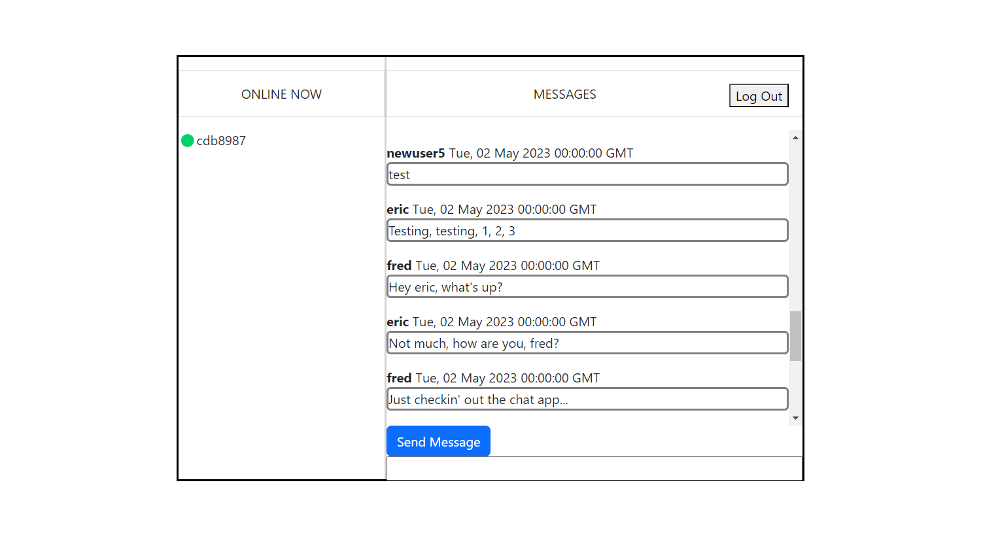

# Chat App

## Description

I created a full-stack application that allows users to create profiles, log in and write messages to each other.  Users can see who else is online and see the message history updated instantly as other users make changes and log in/out.  The purpose of this app was to build, configure and deploy a full stack app (front end, server, database) on hosted platform which allows remote users to interact in real time.  

    1.  FRONT END.  Stack used used is React, Javascript, NPM, NPM, Bootstrap, HTML and CSS. The page is structured as a SPA (single page application) with a Login and Mainpage Component which changes based on login status.     
    2.  SERVER.  Stack used is Python 3.10 and Flask 2.3.  Server routes are established for login functions.  Upon successful login, the requesting client receives a JWT token in their HTTPonly Cookies.  GET/POST requests (for user and message data) are checked by a python decorator which will only allow data retreival if JWT token exists, is not expired, and has not been added to the blacklist.  Logging out adds unexpired JWT tokens to a token blacklist.  
    3.DATABASE  This app uses a PostGres SQL Database for storing user login information (usernames, passwords, etc) as well as messages and their creators.  The database is accessed directly via external URL connection from the Flask Server.  

## Installation Instructions
### Client
1. run 'cd chat-app-front-end'
2. run 'npm install'
3. run 'npm run build'

### Server
1. run 'pip install -r requirements.txt'

# <a href="https://chat-app-sdp2.onrender.com/"> TRY IT LIVE ON RENDER.COM<a>

## Author 
## Charles Brinkman
<a href="https://www.linkedin.com/in/charlesbrinkman">LinkedIN<a>